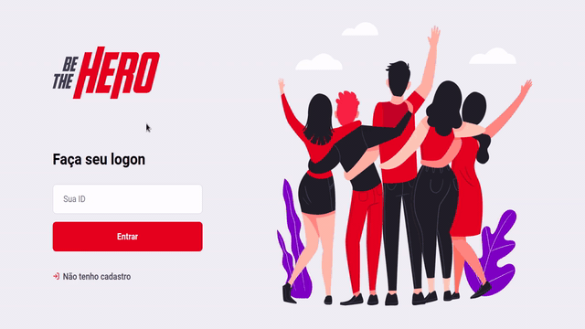
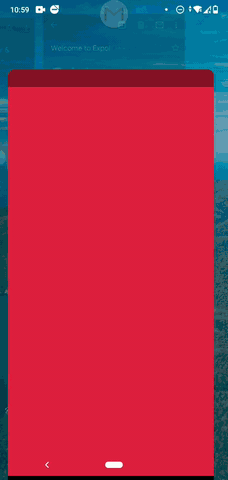

<h4 align="center">
   
</h4>

  
  

<h4 align="center">
 
</h4>

<h1 align="center">
  <strong>This application connects Non-governmental Organizations to the people who want to help!</strong>
</h1>

### :fire: Technologies used in the development

- [NodeJS](https://nodejs.org/en/)
- [Expo](https://expo.io/)
- [Express](https://expressjs.com/pt-br/)
- [Nodemon](https://www.npmjs.com/package/nodemon)
- [Axios](https://www.npmjs.com/package/axios)
- [Cors](https://www.npmjs.com/package/cors)

---

## Screens

### :computer: Web

   

### :iphone: Mobile

   

---

  <strong>This project was developed at the Semana Omnistack 11.0,</strong> 
  ministered by <a href="https://github.com/diego3g">Diego Fernandes</a>, CTO at :rocket: Rocketseat.

